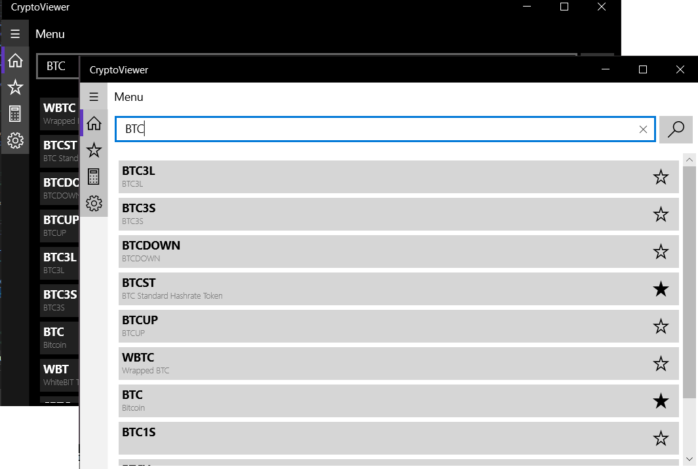

# Вітаю на **[CryptoViewer](https://github.com/YarikVor/CryptoViewer)**! - переглядач валют
CoinViewer - програма для перегляду валют. Підтримує пошук, перегляд та збереження валют, а також містить калькулятор для переведення валюти з одної величини в іншу. Вимагає інтернет! Побудований на API [CryptingUp](https://cryptingup.com/)

## Меню
Інтерфейс програми складається із таких елементів:
- заголовок - назва секції;
- бічна панель - містить звичайну навігацію для переходу між секціями;
- контент - вміст та елементи секції.

### Заголовок
Заголовок слугує для відображення назви відкритої секції;

### Бічна панель
Бічна панель являє собою область для переходу між секціями, що містить в собі кнопки. Щоб збільшити панель, слід натиснути на кнопку бургера, який збільшує бічну панель та відображає повну назву кнопок. Наявні всього чотири кнопки:
- Головне меню;
- Збережені;
- Калькулятор валют;
- Налаштування.

### Секція
Секція являє собою відокремлену сторінку, що виконує певну роль. Всього наявно такі секції:
- Головне меню - містить пошук елементів за їхньою назвою;
- Збереженні - містить збережені користувачем валюти;
- Калькулятор валют - конвертує валюту з одної величини в іншу;
- Налаштування - змінює правила роботи програми.

#### Головне меню
Головне меню являє собою секцію, що містить поле пошуку для знаходження валют за їхньою назвою. Відкривається за замовчуванням на початку, а також містить в собі 10 повернутих валют. Під час пошуку можна або клікнути на валюту, або зберегти. Якщо клікнемо на нюю, то отримаємо вміст валюти. Щоб зберегти валюту, слід натиснути на значок "зірка", яка заносе валюту в локальну пам'ять. Щоб видалити із збереженних, слід натиснути ще раз на зірку, щоб відбулася заливка лише її границь.

#### Збережені
Збереження містять в собі список валют, які зберіг користувач. Їх також можна видалити, натиснувши на зірку.

#### Калькулятор валют
Калькулятор валют представляє собою конвертор, що приймає на вхід дві валюти, які вибираються зі списку доступних, та конвертовується у відповідну валюту.

#### Налаштування
Налаштування містять в собі такі параметри:
- зміни мови інтерфейсу, що підтримує англійську та українську мови;
- зміни теми (яскрава чи темна)

Зміни застосовуються при новому запуску програми.

## Код
### CryptingUp
Для роботи з API CryptingUp створена бібліотека, що містить в собі такі класи:
|Клас|Значення|Посилання для отримання даних
|--|--|--|
|Asset|Активи|`https://cryptingup.com/api/assets`|
|BaseAsset|Базовий актив|`https://cryptingup.com/api/assetsoverview`|
|Exchange|Обмінні компанії|`https://cryptingup.com/api/exchanges`|
|Market|Ринок|``https://cryptingup.com/api/markets``|
|QuoteExchange|Обмін пропозиціями|Отримується з Exchange|
|QuoteMarket|Обмін ринку|Отримується з Market|
|QuoteAsset|Обмін активів|Отримується з Asset|

**Увага!** під час отримання даних по частинно, вказівник на наступні дані генерувався сайтом неправильно. Тому в деяких методах вказано, що його застосовувати не варто.

### Локальні дані
Для роботи з файлами збереження та завантаження даних створений проєкт CryptoViewer.Local, що містить в собі статичні класи LocalData та LocalHashListAsset.

### LocalData
Для збереження інформації налаштувань наявна структура LocalData, що містить в собі наступні властивості:
|Назва властивості|Значення|Застосування
|--|--|--
|LangName|Назва мови (uk_UA, en_US)|Збереження значення мови
|Theme|Тема (світла чи темна)|Збереження значення теми
|IndexSelectTheme| Індекс теми | Застосовується для списків параметрів
|IndexSelectLang| Індекс мови| Застосовується для списків параметрів

### LocalHashListAsset
LocalHashListAsset - статичний клас, який виконує функції збереження списку валют, що обрав користувач. Побудований на основі HashSet. Містить в собі такі властивості:
|Властивість|Тип|Значення
|--|--|--
|Values|IPropertySet|Отримати доступ до полів локального сховища
|Current|IReadOnlyCollection<string>|Отримати колекцію збережених валют у вигляді рядків
|Count|int|Отримати кількість збережених елементів

Методи статичного класу LocalHashListAsset:
|Метод|Тип|Значення
|--|--|--
|Init(IPropertySet values)|void|Ініціалізація на основі інтерфейса IPropertySet 
|Add(string s)|bool|Додати рядок. Повертає true, якщо рядок додано. False, якщо рядок порожній (чи null) або був доданий
|Remove(string s)|bool|Видалити рядок. Повертає true, якщо рядок видалено, інакше false
|Clear()|void|Очищає всі елементи з локального сховища
|Save()|void|Зберігає зміни над сховищем. Викликається методами Add, Remove та Clear
|Contains(string str)|bool| Перевіряє, чи рядок наявний

### Вимоги
Для роботи з програмою потрібна мінімальна версія - Windows 10 (10.0; Build 10240).
Якщо програма не запускається, перевірте з'єднання з мережею.
